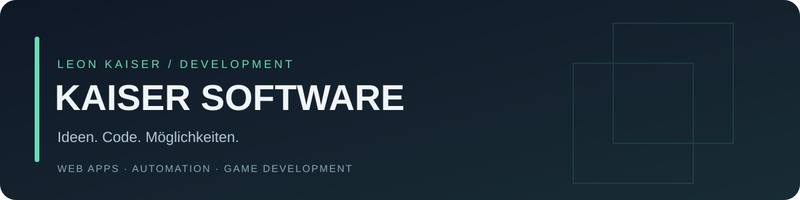

Ich bin **Leon Kaiser**. Unter **Kaiser Software** arbeite ich an Web-Anwendungen, Discord-Bots, Verwaltungswerkzeugen und eigenen Spieleprojekten. Mich interessiert, wie aus einer Idee ein verständliches, nutzbares und wartbares Produkt wird.

[Website](https://kaiser-software.com/) · [Kontakt über Discord](https://discord.gg/kaiser-software) · [Retro Idle ansehen](https://github.com/leonkaiser1896-cyber/retro-idle)

## Arbeitsprobe: Retro Idle

Ein Browser-Idle-Game mit **React, TypeScript und einem Node.js-/SQLite-Server**. Betriebe erwirtschaften Einnahmen; Gebäude, Verbesserungen und Manager erweitern den Fortschritt.

| Schwerpunkt | Umsetzung |
| --- | --- |
| Spielregeln | Deterministische Berechnungen, zentral konfiguriertes Balancing, begrenzter Offline-Fortschritt |
| Architektur | Spielkern, Anwendungsabläufe, Oberfläche und Speicherzugriff getrennt |
| Spielstände | Serverseitig verwalteter Fortschritt, verschlüsselte und authentifizierte Sicherungen |
| Qualität | Automatisierte Regressionstests und CI unter Windows und Linux |

**Für den schnellen Einstieg:** [Code-Rundgang](https://github.com/leonkaiser1896-cyber/retro-idle/blob/main/docs/code-tour.md) · [Startanleitung](https://github.com/leonkaiser1896-cyber/retro-idle#start) · [Automatisierte Prüfungen](https://github.com/leonkaiser1896-cyber/retro-idle/actions)

Retro Idle ist lokal spielbar. Öffentliches Hosting und dauerhafte Accounts stehen noch aus. Das Projekt entstand iterativ mit KI-Unterstützung bei Umsetzung und Review; technische Entscheidungen und Grenzen sind im Repository dokumentiert.

## Womit ich arbeite

| Bereich | Technologien und Themen |
| --- | --- |
| Web & Games | React, TypeScript, JavaScript, HTML/CSS, Vite |
| Backend & Daten | Node.js, Python, SQLite, HTTP-APIs |
| Bots & Tools | Discord-Bots, Rollen und Berechtigungen, Automatisierungen |
| Entwicklung | Git, automatisierte Tests, nachvollziehbare Dokumentation |

Weitere Einblicke in Kaiser Software gibt es auf [kaiser-software.com](https://kaiser-software.com/).
