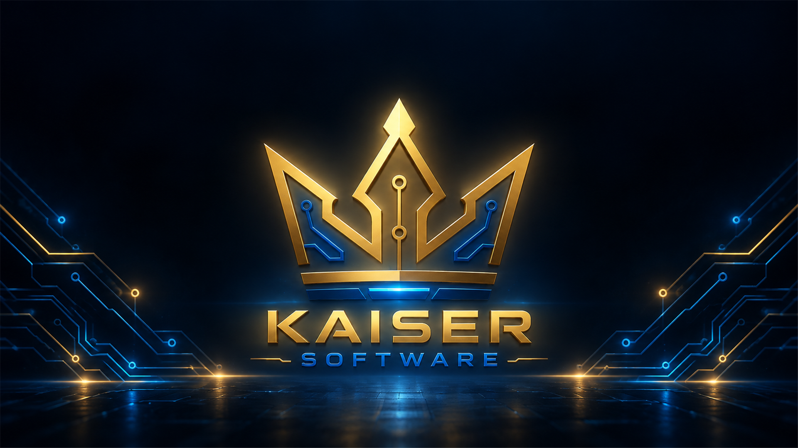
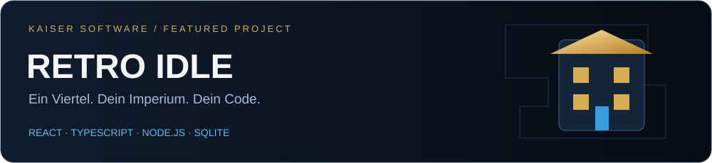

<h3 align="center">IDEEN. CODE. MÖGLICHKEITEN.</h3>

Web-Anwendungen · Discord-Bots · Automatisierung · Game Development

---

### Hinter Kaiser Software

Ich bin **Leon Kaiser**. Ich entwickle eigene Softwareprojekte – vom Verwaltungswerkzeug bis zum Browser-Spiel. Mein Fokus liegt auf verständlichen Oberflächen, sauber getrennten Aufgaben im Code und Funktionen, die sich nachvollziehbar prüfen lassen.

### Ausgewählte Arbeitsprobe

**Retro Idle** verbindet Spielmechanik mit einer vollständigen Web-Anwendung: Betriebe aufbauen, Einnahmen investieren und den Fortschritt auch nach einer Pause fortsetzen.

- **Spielkern:** deterministische Regeln, zentrales Balancing und begrenzter Offline-Fortschritt.
- **Backend:** Node.js und SQLite; Fortschritt wird auf dem Server berechnet, Sicherungen mit AES-256-GCM geschützt.
- **Qualität:** Regressionstests und automatisierte Prüfungen unter Windows und Linux.

**[Projekt öffnen →](https://github.com/leonkaiser1896-cyber/retro-idle)** · [Code-Rundgang](https://github.com/leonkaiser1896-cyber/retro-idle/blob/main/docs/code-tour.md) · [Spielansicht](https://github.com/leonkaiser1896-cyber/retro-idle/blob/main/docs/screenshots/2026-10-06-desktop.png) · [CI ansehen](https://github.com/leonkaiser1896-cyber/retro-idle/actions)

Lokal spielbar. Öffentliches Hosting und dauerhafte Accounts stehen noch aus. Iterativ mit KI-Unterstützung bei Umsetzung und Review entwickelt; Architektur und Grenzen sind im Repository dokumentiert.

### Mein Werkzeugkasten

**Frontend & Games** &nbsp; React · TypeScript · JavaScript · HTML/CSS · Vite  
**Backend & Tools** &nbsp; Node.js · Python · SQLite · HTTP-APIs · Discord-Bots  
**Arbeitsweise** &nbsp; Git · automatisierte Tests · klare Dokumentation

---

<b>Eine Idee wird erst spannend, wenn sie funktioniert.</b> Kaiser Software · Leon Kaiser · <a href="https://kaiser-software.com/">kaiser-software.com</a>

